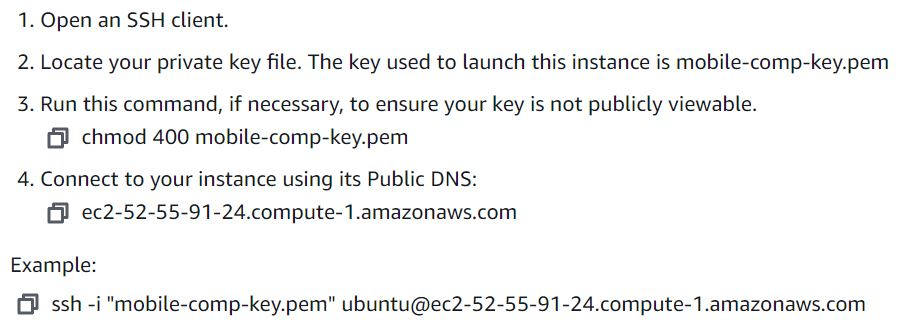

This is server code for both the gesture and the hike app.

To SSH into the server put the pem key file I gave you in your ~/.ssh folder and follow the instructions below. 

(NOTE: the Public DNS URL may change. See the discord for the latest URL)

# Hand Gestures

## Asset locations 
All practice gesture files are stored as 

`/home/ubuntu/HandGesturesPracticeVideos/<gesture name>_PRACTICE_<practice number>_<last name>.mp4`

All frames are stored as 

`/home/ubuntu/HandGesturesPracticeVideos/<gesture name>_PRACTICE_<practice number>_<last name>/<frame number>.png`

All json key point files are stored as

`/home/ubuntu/HandGesturesPracticeVideos/<gesture name>_PRACTICE_<practice number>_<last name>/key_points.json`

All csv key point files are stored as 

`/home/ubuntu/HandGesturesPracticeVideos/<gesture name>_PRACTICE_<practice number>_<last name>/key_points.csv`

## Server
To start the server, first check the status:

`sudo systemctl status web-tier.service`

If it is not running, do the command:

`sudo systemctl start web-tier.service`

If you edit the server file, the server will require a restart. To do that, run the command:

`sudo systemctl restart web-tier.service`

To see the log of what the server is doing, run the command:

`journalctl -f -u web-tier.service`

## Generate frames

To generate frames, put the mp4 in the HandGesturesPracticeVideos folder and run the command from the Python Scripts folder:

`python3 Frames_Extractor.py`

## JSON keypoints

To generate JSON keypoints, run the command from the posenet folder:

`node scale_to_videos.js /home/ubuntu/HandGesturesPracticeVideos/`

## CSV keypoints

To generate csv keypoints from the json keypoints, run the command from the Python Scripts folder:

`python3 convert_to_csv.py /home/ubuntu/HandGesturesPracticeVideos/`
